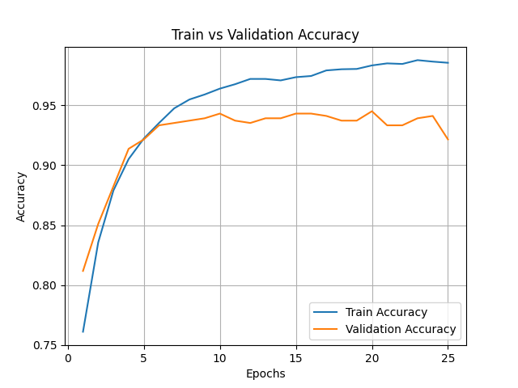
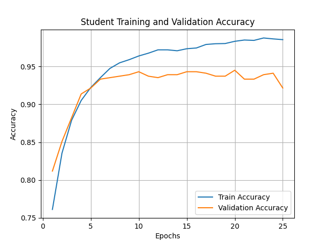
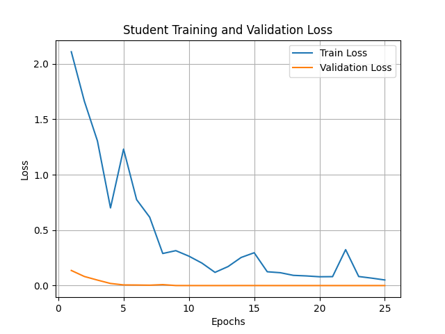
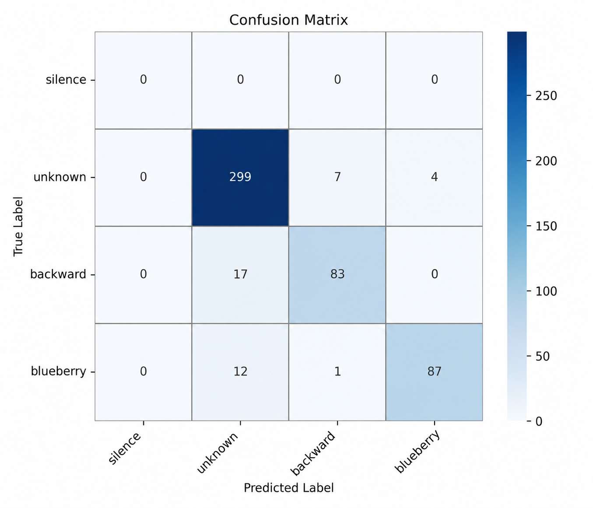

# (ECGR-5127) Project 2: Keyword Spotting on ESP32

## 1. Introduction

In this project, we design, train, and deploy a keyword spotting system on an embedded platform (ESP32). The goal is to recognize spoken keywords from continuous audio input in real time.

Keyword spotting is widely used in voice assistants such as Alexa and Google Assistant. However, deploying such systems on embedded devices introduces several challenges, including limited memory, computational constraints, and noisy environments.

In this project, we aim to build a lightweight yet effective model that can detect keywords reliably under these constraints.

---

## 2. Model Architecture

The model is based on a Convolutional Neural Network (CNN), which is well-suited for processing spectrograms derived from audio signals.

### Processing Pipeline

Audio waveform → Spectrogram (STFT) → CNN → Classification

### Network Structure

* Input: Spectrogram of size approximately (124, 129, 1)
* Conv2D (16 filters, kernel size 3x3, ReLU)
* MaxPooling2D
* Conv2D (32 filters, kernel size 3x3, ReLU)
* MaxPooling2D
* Flatten
* Dense (64 units, ReLU)
* Dropout (0.3)
* Output Dense Layer (Softmax)

This architecture balances accuracy and efficiency, making it suitable for deployment on ESP32.

---

## 3. Data and Training

### Dataset

The dataset consists of four classes:

* **blueberry(1000)**: the custom keyword recorded manually
* **backward(1000)**: a predefined keyword from the Speech Commands dataset
* **unknown(1000)**: other words that are not target commands
* **silence(2000)**: synthetic background/noise clips without any spoken keyword

### Data Collection

The custom keyword *blueberry* was manually recorded. Since the number of original recordings was limited, data augmentation was applied to increase the diversity of the training data. The predefined keyword and unknown samples were obtained from the Speech Commands dataset.

### Preprocessing

* Sampling rate: 16 kHz
* Audio length normalized to 1 second
* Short-Time Fourier Transform (STFT) used to generate spectrograms
* Spectrogram shape: approximately (124, 129, 1)

### Data Augmentation for the Custom Word “blueberry”

To improve the robustness of the keyword spotting model, data augmentation was applied to the custom keyword “blueberry”. The original custom recordings were expanded by generating modified versions of each waveform. These augmented samples help the model learn the keyword under different real-world speaking and recording conditions.

Several waveform-level augmentation techniques were used:

1. **Gaussian Noise Addition**

   Small Gaussian noise was added to the original waveform. This simulates common background noise, microphone noise, and environmental interference. By training with noisy samples, the model becomes more robust when the keyword is spoken in non-ideal acoustic environments.

2. **Time Shifting**

   The waveform was shifted slightly forward or backward in time. This simulates cases where the speaker starts saying the word slightly earlier or later within the 1-second recording window. This helps the model avoid relying on a fixed word position.

3. **Volume Scaling**

   The amplitude of the waveform was randomly increased or decreased. This simulates different speaker volumes and microphone distances. As a result, the model can better recognize the keyword when spoken softly or loudly.

4. **Small Crop and Padding**

   A small portion of the waveform was randomly cropped from the beginning or end, and zero padding was added to keep the clip length fixed at 1 second. This introduces slight timing variation while maintaining the required input length.

These augmentation methods expanded the custom keyword dataset from a small number of original recordings to a larger training set. The goal was not to create completely new words, but to increase acoustic variation so that the model could generalize better to unseen recordings.

### Silence Data Generation

In addition to spoken keywords, a silence class was included in the dataset. The silence class is important because the deployed keyword spotting system continuously listens to audio input. Without a silence class, the model may incorrectly classify background noise or quiet audio as one of the target keywords, causing false positives.

Instead of using only zero-valued silent clips, synthetic silence samples were generated using low-amplitude noise. This is more realistic because real microphones rarely record perfect silence. Even in quiet environments, there may be small background noise, electrical noise, or room noise.

The silence clips were generated using the following noise-related techniques:

1. **Low-Amplitude Gaussian Noise**

   Random Gaussian noise was generated with a very small standard deviation. This simulates microphone background noise and quiet room noise.

2. **Random Volume Variation**

   The noise amplitude was randomly changed for different samples. This helps the model learn different levels of quiet background noise.

3. **Optional Low-Frequency Wave Component**

   A very small sine wave was added to some silence samples to simulate low-frequency background hum, such as fan noise, air conditioning noise, or electrical noise.

Each generated silence clip was 1 second long at a 16 kHz sampling rate. These clips were saved under the `data/silence/` folder so that they could be loaded automatically by the training pipeline.

### Training Details

* Optimizer: Adam
* Loss: Sparse Categorical Cross-entropy
* Batch size: 32
* Epochs: 25

---

## 4. Results
- **Teacher Accuracy Curve:**  
  
- **Student Accuracy Curve:**  
  
- **Loss Curve:**  
  
- **Confusion Matrix:**  
  

### Summary Table of Experimental Results

Table 1 summarizes the key experimental results required for evaluating the keyword spotting system. The software accuracy was measured in TensorFlow using the training, validation, and test datasets. The false rejection rate (FRR) was computed separately for the predefined Speech Commands keyword and the custom keyword. The model complexity is reported using the number of trainable parameters and multiply-accumulate operations (MACs). The deployment-related results include the input tensor shape, frame rate, and false alarm rate measured in the streaming test.

| Metric                                 |        Result | Description                                                                      |
|----------------------------------------|--------------:|----------------------------------------------------------------------------------|
| Teacher Training Accuracy              |        99.75% | Accuracy measured on the training dataset in TensorFlow                          |
| Teacher Validation Accuracy            |        93.92% | Accuracy measured on the validation dataset in TensorFlow                        |
| Teacher Test Accuracy                  |        92.16% | Accuracy measured on the held-out test dataset in TensorFlow                     |
| Student Training Accuracy              |        99.14% | Accuracy measured on the training dataset in TensorFlow                          |
| Student Validation Accuracy            |        92.16% | Accuracy measured on the validation dataset in TensorFlow                        |
| Student Test Accuracy                  |        91.96% | Accuracy measured on the held-out test dataset in TensorFlow                     |
| FRR for Speech Commands Word: backward |           17% | False rejection rate for the predefined keyword from the Speech Commands dataset |
| FRR for Custom Word: blueberry         |           13% | False rejection rate for the custom keyword recorded manually                    |
| Teacher Number of Parameters           |       1786884 | Total number of trainable parameters in the CNN model                            |
| Student Number of Parameters           |        446852 | Total number of trainable parameters in the CNN model                            |
| Teacher MACs                           |      20597344 | Estimated multiply-accumulate operations per inference                           |
| Student MACs                           |       5707184 | Estimated multiply-accumulate operations per inference                           |
| Input Tensor Shape                     | 124 × 129 × 1 | Spectrogram input shape used by the CNN model                                    |
| Audio Sampling Rate                    |        16 kHz | Raw audio sampling rate used for recording and preprocessing                     |

The results show that the model achieved good software performance on the training, validation, and test sets. The test accuracy indicates how well the model generalizes to unseen audio samples. The FRR values provide a more detailed view of how often each target keyword is missed. A lower FRR means the model is more reliable at detecting that specific keyword.

---

## 5. Exploration

Beyond the baseline implementation, several improvements were explored:

### Data Augmentation

* Added background noise
* Applied time shifting
* Improved robustness to real-world environments

### Model Architecture

* Tested different CNN sizes
* Balanced model complexity and performance

### Quantization

* Converted model from float32 to int8
* Reduced model size and enabled ESP32 deployment

### Dataset Balancing

* Increased the number of unknown samples
* Reduced false positives

---

## 6. Discussion

Overall, the system demonstrates reasonable performance given the constraints of embedded hardware.

### Strengths

* Real-time keyword detection
* Lightweight model suitable for ESP32
* End-to-end pipeline from training to deployment

### Limitations

* Sensitivity to background noise
* Limited dataset size
* Occasional false positives

### Improvements

* Collect more diverse training data
* Use more advanced architectures (e.g., depthwise CNN)
* Apply better noise filtering techniques

---

## 7. Conclusion

In this project, we successfully developed a keyword spotting system and deployed it on an embedded platform.

The system can detect both a custom keyword and a predefined word in real time. This demonstrates the feasibility of running machine learning models on low-power devices.

Future work includes improving accuracy, reducing false positives, and expanding the vocabulary.
